<div align="center">

[**简体中文**](./README.md) · English



[](https://88lin.github.io/react-ai-orb/)
[](https://react.dev/)
[](https://www.typescriptlang.org/)
[](#-installation)
[](./LICENSE)

**A beautiful, customizable animated orb component for React.**

Perfect for AI interfaces, assistants, chatbots, or anywhere you need a glowing orb ✨

**[🎧 Live Demo](https://88lin.github.io/react-ai-orb/)** · [✨ Highlights](#-highlights) · [🚀 Quick Start](#-quick-start) · [🔧 Props](#-props) · [🌈 Presets](#-presets) · [🎨 Palettes](#-palettes) · [❓ FAQ](#-faq)

</div>

---

## ✨ Highlights

> A CSS-driven glowing orb with zero runtime dependencies, about 4.8 KB gzipped — drop it in and go.

|  |  |
| :--- | :--- |
| 🎨 **8 palettes · 8 presets** | Built-in `cosmicNebula`, `galaxy`, `oceanDepths` and more — or bring your own colors |
| ⚡ **CSS-driven animation** | No canvas, no WebGL, no animation library — lightweight by design |
| 🔄 **Live-tunable speed** | Speed is applied through the Web Animations `playbackRate`, so the orb accelerates from where it is instead of restarting |
| 📐 **Fully scalable** | Stays crisp from a tiny inline status dot to a full-screen centerpiece |
| 💅 **Zero style setup** | CSS is inlined into the build output — no extra stylesheet `import` |
| 🧩 **TypeScript-first** | Type definitions are committed alongside `dist/`, so completions work right after install |
| ⚛️ **Next.js friendly** | Works with App Router — just use it as a client component |

## 📑 Table of Contents

| Get started | Use it | Customize | Project |
| :--- | :--- | :--- | :--- |
| [🚀 Quick Start](#-quick-start)<br>[📦 Installation](#-installation) | [💻 Usage](#-usage)<br>[▲ Next.js](#-nextjs)<br>[❓ FAQ](#-faq) | [🔧 Props](#-props)<br>[🌈 Presets](#-presets)<br>[🎨 Palettes](#-palettes) | [🧰 Tech Stack](#-tech-stack)<br>[📁 Project Structure](#-project-structure)<br>[🔨 Development](#-development)<br>[🤝 Contributing](#-contributing) |

## 🚀 Quick Start

```bash
npm i github:88lin/react-ai-orb
```

```jsx
import { Orb } from "react-ai-orb";

export const Assistant = () => <Orb />;
```

That's it — a glowing, rotating, color-shifting orb is running.

> [!TIP]
> Want to see it first? Visit the [live demo](https://88lin.github.io/react-ai-orb/).

## 📦 Installation

> [!IMPORTANT]
> This project is **not published to npm or any other registry — install it from Git**.
> The `react-ai-orb` package on npm is the [upstream original](https://github.com/Steve0929/react-ai-orb) and does not include this fork's changes.

The build output in `dist/` is committed to the repository, so installs work out of the box with **no local build step**:

```bash
# npm
npm i github:88lin/react-ai-orb

# pnpm
pnpm add github:88lin/react-ai-orb

# bun
bun add github:88lin/react-ai-orb

# yarn
yarn add react-ai-orb@github:88lin/react-ai-orb
```

> [!NOTE]
> Requires React 19 — `react` / `react-dom` `^19.0.0` are peer dependencies.

<details>
<summary><b>Pinning · full Git URL · updating · no dependency at all</b></summary>

**Pin to a commit** (recommended for production, so a moving default branch can't surprise you):

```bash
npm i github:88lin/react-ai-orb#<commit-sha>
```

**Use the full Git URL** (restricted networks, or when you need SSH):

```bash
npm i git+https://github.com/88lin/react-ai-orb.git
npm i git+ssh://git@github.com/88lin/react-ai-orb.git
```

**Update to the latest commit**: a Git dependency is pinned by the lockfile to the commit it resolved to, so re-run the install command to pull the newest code:

```bash
npm i github:88lin/react-ai-orb
```

**Prefer no dependency at all**: clone the repo and copy `components/`, `palette/`, `presets.ts`, `constants.ts` and `types.ts` from `src/` straight into your project — the component has no external dependencies.

</details>

## 💻 Usage

### Basic

```jsx
import { Orb } from "react-ai-orb";

const MyComponent = () => <Orb />;
```

Styles are inlined into the build output, so there is no CSS file to import.

### Sizing

`size` is a multiplier of the orb's **base 82px diameter**:

```jsx
<Orb size={0.5} />   {/* 41px  — inline status dot */}
<Orb size={1} />     {/* 82px  — default */}
<Orb size={4} />     {/* 328px — hero element */}
```

### Reacting to state

Speed props can be changed at any time. The orb ramps up or down from its current position, so there is **no visible jump** when the value changes:

```jsx
import { useState } from "react";
import { Orb } from "react-ai-orb";

const Assistant = () => {
  const [isThinking, setIsThinking] = useState(false);

  return (
    <button onClick={() => setIsThinking((t) => !t)}>
      <Orb animationSpeedBase={isThinking ? 3 : 1} />
    </button>
  );
};
```

## ▲ Next.js

> [!NOTE]
> The component uses hooks and browser APIs, so in the Next.js App Router it needs to be a **client component**:

```jsx
"use client";
import { Orb } from "react-ai-orb";
```

## 🔧 Props

Every prop is optional.

| Prop | Type | Default | Description |
| :--- | :--- | :--- | :--- |
| `palette` | `OrbPalette` | `cosmicNebula` | Colors for the orb. Use a [built-in palette](#-palettes) or a custom one. |
| `size` | `number` | `1` | Size multiplier, relative to the base 82px diameter. |
| `animationSpeedBase` | `number` | `1` | Rotation speed multiplier. Safe to change at runtime — adjusts smoothly instead of restarting. |
| `animationSpeedHue` | `number` | `1` | Hue-shift speed multiplier. Also safe to change at runtime. |
| `hueRotation` | `number` | `120` | How far the colors travel during the hue animation, in degrees. `0` disables the shift. |
| `mainOrbHueAnimation` | `boolean` | `false` | Applies the hue animation to the main orb body as well as the inner shapes. |
| `blobAOpacity` | `number` | `0.3` | Opacity of blob A (`0` to `1`). |
| `blobBOpacity` | `number` | `0.8` | Opacity of blob B (`0` to `1`). |
| `noShadow` | `boolean` | `false` | Removes the orb's drop shadow. |

## 🌈 Presets

> [!TIP]
> A preset is just a bundle of props — spread it, then override anything you like.

<p align="center">
  
</p>

```jsx
import { Orb, oceanDepthsPreset } from "react-ai-orb";

const MyComponent = () => <Orb {...oceanDepthsPreset} />;

// Override anything you like
const BiggerAndFaster = () => (
  <Orb {...oceanDepthsPreset} size={2} animationSpeedBase={1.5} />
);
```

| Preset | Palette | Also tweaks |
| :--- | :--- | :--- |
| 🪼 `oceanDepthsPreset` | `oceanDepths` | Dimmer blob B |
| 🌌 `galaxyPreset` | `galaxy` | Faster rotation, full 360° hue sweep, dimmer blob B |
| 🌊 `caribeanPreset` | `caribean` | — |
| 🌸 `cherryBlossomPreset` | `cherryBlossom` | Hue shift disabled |
| ❇️ `emeraldPreset` | `emerald` | Hue shift disabled, dimmer blob B |
| 🦄 `multiColorPreset` | `cosmicNebula` | Slow hue shift across the whole orb |
| ☀️ `goldenGlowPreset` | `goldenGlow` | Hue shift disabled, dimmer blob B |
| 🌋 `volcanicPreset` | `volcanic` | Hue shift disabled, dimmer blob B |

## 🎨 Palettes

Eight palettes ship with the repository:

`cosmicNebula` · `caribean` · `cherryBlossom` · `galaxy` · `oceanDepths` · `emerald` · `goldenGlow` · `volcanic`

```jsx
import { Orb, colorPalettes } from "react-ai-orb";

const MyComponent = () => <Orb palette={colorPalettes.galaxy} />;
```

### Custom palettes

Spread a built-in palette and change only the colors you care about:

```tsx
import { Orb, colorPalettes, type OrbPalette } from "react-ai-orb";

const midnight: OrbPalette = {
  ...colorPalettes.galaxy,
  mainBgStart: "#1a0b2e",
  mainBgEnd: "#3d1e6d",
};

const MyComponent = () => <Orb palette={midnight} />;
```

<details>
<summary><b>All <code>OrbPalette</code> properties</b></summary>

The orb is built from a main body plus four rotating inner shapes. Shapes B, C and D take a three-stop gradient; shape A takes two.

| Property | Type | Description |
| :--- | :--- | :--- |
| `mainBgStart` / `mainBgEnd` | `string` | Gradient of the orb's main background. |
| `shadowColor1` … `shadowColor4` | `string` | The four layered shadow colors. |
| `shapeAStart` / `shapeAEnd` | `string` | Gradient of shape A. |
| `shapeBStart` / `shapeBMiddle` / `shapeBEnd` | `string` | Gradient of shape B. |
| `shapeCStart` / `shapeCMiddle` / `shapeCEnd` | `string` | Gradient of shape C. |
| `shapeDStart` / `shapeDMiddle` / `shapeDEnd` | `string` | Gradient of shape D. |

</details>

## ❓ FAQ

<details>
<summary><b>Why doesn't <code>npm i react-ai-orb</code> give me this version?</b></summary>

This repository is not published to npm. The package with that name is the [upstream original](https://github.com/Steve0929/react-ai-orb) and does not contain this fork's changes — install from Git as shown under [Installation](#-installation).

</details>

<details>
<summary><b>Do I need to import a CSS file?</b></summary>

No. The CSS is inlined into `dist/` at build time and injected when the component loads.

</details>

<details>
<summary><b>Does it support React 18?</b></summary>

This repository targets React 19 and declares `^19.0.0` as its peer dependency. If you are still on React 18, use the upstream release `react-ai-orb@1.0.13` instead.

</details>

<details>
<summary><b>Does it work with SSR?</b></summary>

Yes. The component checks for `window` and falls back to `useEffect` on the server, so it never touches browser APIs during render; the speed logic only runs after the client mounts. In Next.js, add `"use client"`.

</details>

<details>
<summary><b>What happens in browsers without the Web Animations API?</b></summary>

The component checks for `element.getAnimations` first and skips the speed logic when it is unavailable: the CSS animations keep playing at the base speed and nothing throws.

</details>

## 🧰 Tech Stack

| Tech | Role |
| :--- | :--- |
| [React 19](https://react.dev/) | UI library, consumed as a peer dependency |
| [TypeScript 5](https://www.typescriptlang.org/) | Type safety; `.d.ts` files are committed with the build output |
| [Rollup](https://rollupjs.org/) | Bundles CJS + ESM output into `dist/` |
| [Vite](https://vite.dev/) | Dev server and build for the `demo/` preview |
| CSS-only animation | No canvas / WebGL / animation lib, zero runtime deps |

## 📁 Project Structure

```text
react-ai-orb/
├── src/                        # component source
│   ├── components/
│   │   ├── Orb/
│   │   │   ├── Orb.tsx         # component body, incl. playbackRate speed logic
│   │   │   └── styles.css      # orb and animation styles
│   │   └── SvgElements/
│   │       └── SvgElements.tsx # SVG inner shapes
│   ├── palette/
│   │   └── colorPalettes.ts    # 8 built-in palettes
│   ├── constants.ts            # base sizes, defaults, animation constants
│   ├── presets.ts              # 8 presets
│   ├── types.ts                # OrbPalette & types
│   └── index.ts                # entry exports
├── dist/                       # build output (committed, ready for Git installs)
├── demo/                       # Vite preview, imports src/ directly
│   ├── src/
│   │   ├── App.tsx
│   │   ├── main.tsx
│   │   └── demo.css
│   ├── index.html
│   └── vite.config.ts
├── .github/
│   ├── assets/                 # README banners (zh / en)
│   └── workflows/
│       ├── deploy.yml          # deploys the demo to GitHub Pages
│       └── star-history.yml    # regenerates the Star History chart weekly
├── rollup.config.js
├── tsconfig.json
└── package.json
```

## 🔨 Development

```bash
git clone https://github.com/88lin/react-ai-orb.git
cd react-ai-orb
npm install
npm run build          # bundles to dist/ with rollup
```

Preview the demo locally (it imports `src/` directly, so changes hot-reload without a build):

```bash
cd demo
npm install
npm run dev
```

> [!TIP]
> After editing `src/`, run `npm run build` and commit `dist/` as well — Git installs serve exactly what the repository contains.

## 🤝 Contributing

Issues and PRs are welcome — new palettes, new presets, bug fixes, or docs improvements.

## 📄 License

[MIT](./LICENSE) © [88lin](https://github.com/88lin)

## 🙏 Acknowledgments

This project is built on top of [Steve0929/react-ai-orb](https://github.com/Steve0929/react-ai-orb) — many thanks to the original author [@Steve0929](https://github.com/Steve0929) for the excellent work.

---

## ⭐ Star History

<div align="center">

<picture>
  <source media="(prefers-color-scheme: dark)" srcset="https://raw.githubusercontent.com/88lin/react-ai-orb/star-history/assets/my-star-history/star-history-dark.svg">
  
</picture>

<br><br>

**If this project helps you, give it a ⭐ Star!**

Made with 🔮 by [88lin](https://github.com/88lin)

</div>
