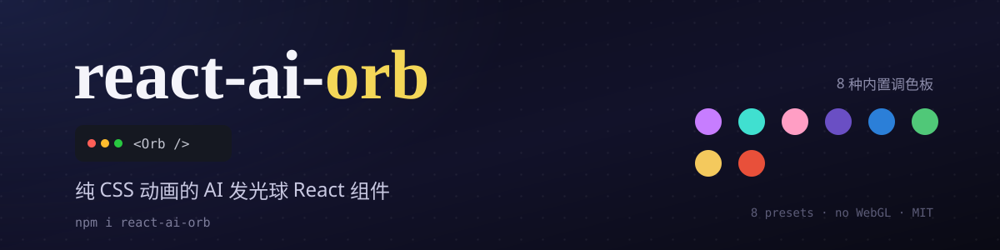

<div align="center">

简体中文 · **[English](./README.en.md)**



[](https://88lin.github.io/react-ai-orb/)
[](https://react.dev/)
[](https://www.typescriptlang.org/)
[](https://www.npmjs.com/package/react-ai-orb)
[](./LICENSE)

**一个美观、可定制的 React 动画球体组件。**
适合 AI 界面、智能助手、聊天机器人，或者任何需要一颗发光球体的地方 ✨

</div>

---

## 亮点

> 纯 CSS 驱动的发光球体，零运行时依赖，开箱即用。

| | |
| :--- | :--- |
| 🎨 **8 套调色板 · 8 个预设** | 内置 `cosmicNebula`、`galaxy`、`oceanDepths` 等，也支持完全自定义颜色 |
| ⚡ **纯 CSS 动画** | 不依赖 canvas、WebGL 或任何动画库，性能轻盈 |
| 🔄 **速度实时可调** | 运行时修改速度属性，球体从当前位置平滑加速，不会跳帧重启 |
| 📐 **任意缩放** | 从内联状态点到全屏主视觉都清晰锐利 |
| 🧩 **TypeScript 优先** | 类型定义随包发布，开发体验完整 |
| ⚛️ **Next.js 友好** | 兼容 App Router，按客户端组件使用即可 |

## 📑 目录

- [🚀 快速开始](#-快速开始)
- [📦 安装](#-安装)
- [💻 用法](#-用法)
- [⚛️ Next.js](#️-nextjs)
- [⚙️ Props](#️-props)
- [📦 预设](#-预设)
- [🎨 调色板](#-调色板)
- [👨‍💻 开发](#-开发)
- [🤝 贡献](#-贡献)
- [📄 许可证](#-许可证)
- [🙏 致谢](#-致谢)

## 🚀 快速开始

```bash
npm i react-ai-orb
```

```jsx
import { Orb } from "react-ai-orb";

export const Assistant = () => <Orb />;
```

就这么简单——一颗会发光、会旋转、会变色的球体已经跑起来了。

## 📦 安装

```bash
npm i react-ai-orb
# 或
pnpm add react-ai-orb
# 或
yarn add react-ai-orb
```

> **环境要求**：React 19（`react` / `react-dom` `^19.0.0` 为 peer 依赖）。
> 仍在用 React 18？请安装 [`react-ai-orb@1.0.13`](https://www.npmjs.com/package/react-ai-orb/v/1.0.13)。

## 💻 用法

### 基础用法

```jsx
import { Orb } from "react-ai-orb";

const MyComponent = () => <Orb />;
```

### 尺寸

`size` 是相对于 **82px 基准直径**的倍数：

```jsx
<Orb size={0.5} />   {/* 41px — 内联状态点 */}
<Orb size={1} />     {/* 82px — 默认          */}
<Orb size={4} />     {/* 328px — 主视觉       */}
```

### 响应状态变化

速度类属性可以随时修改，球体会从当前状态平滑过渡，**不会跳回起始帧**：

```jsx
import { useState } from "react";
import { Orb } from "react-ai-orb";

const Assistant = () => {
  const [isThinking, setIsThinking] = useState(false);

  return (
    <button onClick={() => setIsThinking((t) => !t)}>
      <Orb animationSpeedBase={isThinking ? 3 : 1} />
    </button>
  );
};
```

## ⚛️ Next.js

组件使用了浏览器 API，需要作为**客户端组件**使用：

```jsx
"use client";
import { Orb } from "react-ai-orb";
```

## ⚙️ Props

所有属性均为可选。

| Prop                  | 类型         | 默认值         | 说明 |
| --------------------- | ------------ | -------------- | ---- |
| `palette`             | `OrbPalette` | `cosmicNebula` | 球体配色，可用[内置调色板](#-调色板)或自定义 |
| `size`                | `number`     | `1`            | 尺寸倍数，基于 82px 基准直径 |
| `animationSpeedBase`  | `number`     | `1`            | 旋转速度倍数，可运行时修改、平滑过渡 |
| `animationSpeedHue`   | `number`     | `1`            | 变色速度倍数，同样支持运行时修改 |
| `hueRotation`         | `number`     | `120`          | 色相动画的偏移角度（度） |
| `mainOrbHueAnimation` | `boolean`    | `false`        | 是否对主球体也应用色相动画 |
| `blobAOpacity`        | `number`     | `0.3`          | 光斑 A 的不透明度（`0` ~ `1`） |
| `blobBOpacity`        | `number`     | `0.8`          | 光斑 B 的不透明度（`0` ~ `1`） |
| `noShadow`            | `boolean`    | `false`        | 移除球体投影 |

## 📦 预设

预设就是一组 props 的集合，可以直接展开，再覆盖任意属性。

<p align="center"></p>

```jsx
import { Orb, oceanDepthsPreset } from "react-ai-orb";

const MyComponent = () => <Orb {...oceanDepthsPreset} />;

// 任意覆盖
const BiggerAndFaster = () => (
  <Orb {...oceanDepthsPreset} size={2} animationSpeedBase={1.5} />
);
```

| 预设                     | 调色板          | 额外调整 |
| ------------------------ | --------------- | -------- |
| 🪼 `oceanDepthsPreset`   | `oceanDepths`   | 光斑 B 更淡 |
| 🌌 `galaxyPreset`        | `galaxy`        | 转速更快、360° 全幅变色、光斑 B 更淡 |
| 🌊 `caribeanPreset`      | `caribean`      | — |
| 🌸 `cherryBlossomPreset` | `cherryBlossom` | 关闭变色 |
| ❇️ `emeraldPreset`       | `emerald`       | 关闭变色、光斑 B 更淡 |
| 🦄 `multiColorPreset`    | `cosmicNebula`  | 全球缓慢变色 |
| ☀️ `goldenGlowPreset`    | `goldenGlow`    | 关闭变色、光斑 B 更淡 |
| 🌋 `volcanicPreset`      | `volcanic`      | 关闭变色、光斑 B 更淡 |

## 🎨 调色板

包内内置 8 套调色板：

```jsx
import { Orb, colorPalettes } from "react-ai-orb";

const MyComponent = () => <Orb palette={colorPalettes.galaxy} />;
```

`cosmicNebula` · `caribean` · `cherryBlossom` · `galaxy` · `oceanDepths` · `emerald` · `goldenGlow` · `volcanic`

### 自定义调色板

展开内置调色板，只改你关心的颜色：

```tsx
import { Orb, colorPalettes, type OrbPalette } from "react-ai-orb";

const midnight: OrbPalette = {
  ...colorPalettes.galaxy,
  mainBgStart: "#1a0b2e",
  mainBgEnd: "#3d1e6d",
};

const MyComponent = () => <Orb palette={midnight} />;
```

<details>
<summary><b>全部 <code>OrbPalette</code> 属性</b></summary>

球体由一个主球加四个旋转内形构成。B、C、D 三个内形是三段渐变，A 是两段渐变。

| 属性                                          | 类型     | 说明 |
| --------------------------------------------- | -------- | ---- |
| `mainBgStart` / `mainBgEnd`                   | `string` | 主球背景渐变 |
| `shadowColor1` … `shadowColor4`               | `string` | 四层投影颜色 |
| `shapeAStart` / `shapeAEnd`                   | `string` | 内形 A 渐变 |
| `shapeBStart` / `shapeBMiddle` / `shapeBEnd`  | `string` | 内形 B 渐变 |
| `shapeCStart` / `shapeCMiddle` / `shapeCEnd`  | `string` | 内形 C 渐变 |
| `shapeDStart` / `shapeDMiddle` / `shapeDEnd`  | `string` | 内形 D 渐变 |

</details>

## 👨‍💻 开发

```bash
npm install
npm run build    # 使用 rollup 打包到 dist/
```

本地预览 demo：

```bash
cd demo
npm install
npm run dev
```

## 🤝 贡献

欢迎提交 Issue 或 PR——新调色板、新预设、bug 修复或文档改进都可以。

## 📄 许可证

[MIT](./LICENSE) © [88lin](https://github.com/88lin)

## 🙏 致谢

本项目基于 [Steve0929/react-ai-orb](https://github.com/Steve0929/react-ai-orb) 二次开发，
感谢原作者 [@Steve0929](https://github.com/Steve0929) 的出色工作。
